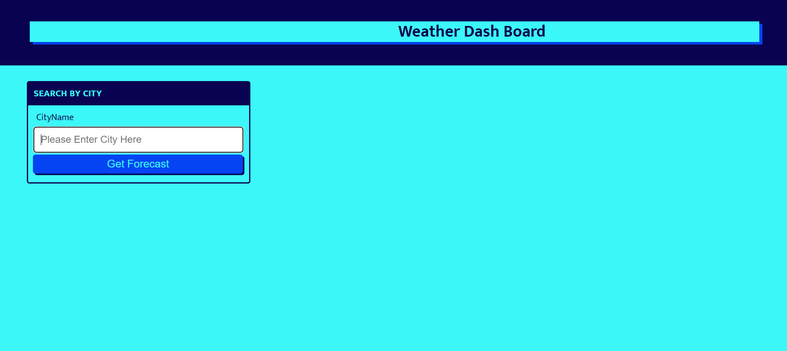
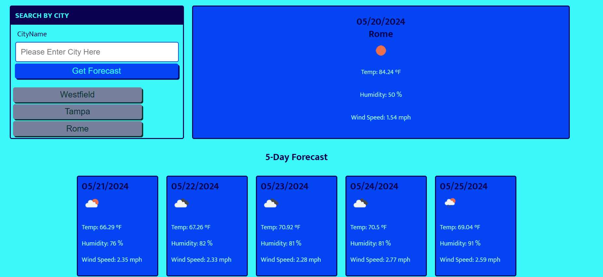
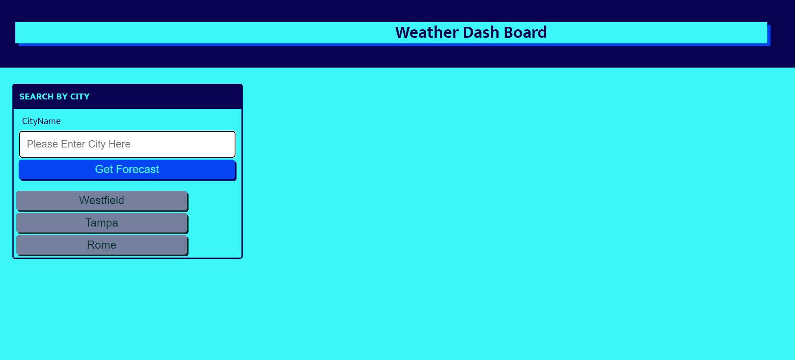

Title: 
My-Weather-Forecast-App

Description:
In this challenge, I have created a forecasting app using JavaScript, CSS and HTML while using bootstrap classes. When a user enters a city name in the search box, then initiates the search - the forecast information is pulled using WeatherAPI to display data dynamically for today's data and 5-day-forecast after today's date for the city that is entered. The searched cities are saved below the search box for ease of access as a button to retrive this information again if user needed.

How to Run:
Simply go on to the website and type in the search box the city that you want the weather information for. The site will display today's forecast and 5 more days in case you are planning a trip or you simply want to see how the weather will look like in the coming days of the week. Once the city is entered, the website stores the city names and makes them as buttons under the search box for future use. The city name information is saved in local storage to be able to access and run the WeatherAPI fetch request with one click. You may look for your favorite cities information by clicking on the buttons with your city's name on it. Then the page will refresh and show you the current day and 5 more days forecast.

Enjoy!

Deployed version link: 

